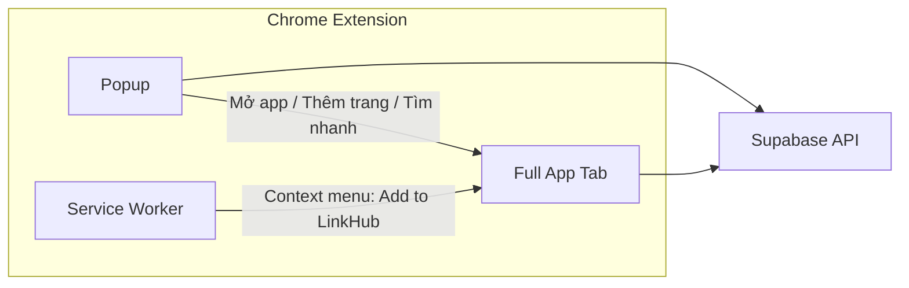

# Plan: Chrome Extension cho LinkHub Bookmark Manager

## Tổng quan tính năng hiện có (cần có trong Extension)


| Nhóm           | Tính năng                                                                                                                                  |
| -------------- | ------------------------------------------------------------------------------------------------------------------------------------------ |
| **Auth**       | Đăng nhập, Đăng ký, Đăng xuất, Cập nhật profile (tên, avatar, locale, theme)                                                               |
| **Boards**     | Tạo/Sửa/Xóa board, Nhân bản board (kèm categories + bookmarks), Kéo thả sắp xếp, Chọn board trên Sidebar                                   |
| **Categories** | Tạo/Sửa/Xóa category, Nhân bản category (kèm bookmarks), Di chuyển sang board khác, Kéo thả sắp xếp                                        |
| **Bookmarks**  | Tạo/Sửa/Xóa bookmark, Nhân bản, Kéo thả sắp xếp trong category                                                                             |
| **Tìm kiếm**   | Tìm theo board/category/bookmark (debounce), dropdown kết quả, click chuyển board/category                                                 |
| **Cài đặt**    | Màu nền, số cột, chiều cao category, Dark/Light, Mở link tab mới, Bật/tắt kéo thả (board/category/bookmark), Import JSON/HTML, Export HTML |
| **IT Tool**    | Tab URL (encode/decode), JWT (decode/encode HS256), JSON (format/validate), Query string ↔ JSON, XML (placeholder)                         |
| **i18n**       | Tiếng Việt / English                                                                                                                       |


---

## Kiến trúc Extension (Manifest V3)




- **Popup**: Cửa sổ nhỏ khi click icon — nút "Mở LinkHub", "Thêm trang này", ô tìm nhanh (optional).
- **Full App (Extension Page)**: Toàn bộ app hiện tại (Login, Register, Dashboard với Sidebar, Categories, Bookmarks, Search, Settings, IT Tool) chạy trong một tab extension (URL dạng `chrome-extension://<id>/index.html`).
- **Service Worker (background)**: Context menu "Add to LinkHub" để thêm trang hiện tại vào bookmark; có thể sync session với full app nếu cần.

---

## Cấu trúc thư mục đề xuất

```
Bookmark/
├── public/                    # Giữ nguyên (favicon, v.v.)
├── src/                       # Giữ nguyên toàn bộ (App, Dashboard, hooks, contexts, components)
├── extension/
│   ├── manifest.json          # Manifest V3
│   ├── popup/
│   │   ├── popup.html
│   │   ├── popup.tsx          # Entry React nhẹ cho popup
│   │   └── popup.css
│   ├── background/
│   │   └── service-worker.ts  # Context menu, optional messaging
│   └── icons/                 # 16, 48, 128 px
├── index.html                 # Web app (hiện tại)
├── extension.html             # Full app entry cho extension (load cùng src/App)
├── vite.config.ts            # Sửa: build 2 outputs (app + extension)
└── package.json              # Thêm script "build:extension"
```

- **Không** tách duplicate code: toàn bộ `src/` dùng chung cho cả web build và extension build. Chỉ khác entry HTML và cách build.

---

## Các bước triển khai chính

### 1. Manifest V3 và cấu hình build

- Tạo [extension/manifest.json](extension/manifest.json):
  - `manifest_version: 3`
  - `permissions`: `storage` (optional, cho prefs), `contextMenus`, `activeTab` (cho "thêm trang này")
  - `host_permissions`: domain Supabase (ví dụ `https://*.supabase.co`) để fetch API
  - `action.default_popup`: `popup/popup.html`
  - `background.service_worker`: `background/service-worker.js` (output từ build)
  - Trang full app: dùng `chrome.tabs.create({ url: 'index.html' })` trong popup; trong extension thì `index.html` là `extension.html` (bundle tên `index.html` trong thư mục extension)
- Cấu hình Vite:
  - Build **multi-page**: (1) `index.html` → web app như hiện tại; (2) `extension.html` → entry extension full app (cùng `src/main.tsx` hoặc `src/main-extension.tsx` chỉ đổi `BrowserRouter` baseline nếu cần); (3) popup entry; (4) service worker entry.
  - Output extension vào `dist-extension/` (hoặc `extension/dist/`), copy `manifest.json` và `icons` vào cùng thư mục sau build.
- Trong extension, **environment variables** (Supabase URL/Key): dùng `import.meta.env.VITE_*` như hiện tại; khi build extension, đảm bảo file env hoặc define được inject đúng (Vite thay thế tại build time).

### 2. Entry point Full App trong Extension

- Tạo [extension.html](extension.html) (ở root) với nội dung tương tự [index.html](index.html), nhưng script trỏ tới bundle cho extension (ví dụ `src/main.tsx`).
- Trong `main.tsx`: giữ `BrowserRouter`; với extension, base URL có thể là `chrome-extension://__MSG_@@extension_id__/` hoặc path tương đối `/`. Cần set `basename` cho React Router tương ứng (ví dụ `basename={import.meta.env.BASE_URL}`) để route `/`, `/login`, `/register` hoạt động khi mở từ extension.
- Đảm bảo font/icons (Google Fonts, Material Symbols) load được trong extension (CSP trong manifest cho phép `https://fonts.googleapis.com` nếu cần).

### 3. Popup

- [extension/popup/popup.html](extension/popup/popup.html): một thẻ `div#root`, script bundle popup.
- Popup React ([extension/popup/popup.tsx](extension/popup/popup.tsx)): giao diện tối giản:
  - Nút chính: "Mở LinkHub" → `chrome.tabs.create({ url: chrome.runtime.getURL('extension.html') })` (hoặc path tương ứng tới full app).
  - Nút "Thêm trang này": lấy `chrome.tabs.query({ active: true })` → url + title → mở full app với query params (ví dụ `?add=&url=...&title=...`) để Dashboard mở sẵn modal thêm bookmark với url/title điền sẵn; hoặc gửi message tới service worker lưu tạm, full app đọc khi mở.
  - (Tuỳ chọn) Ô tìm kiếm nhanh: gọi Supabase search (cần access token từ storage hoặc từ full app đã login); nếu chưa login thì chỉ hiện "Mở LinkHub để đăng nhập".
- Popup build: một entry Vite riêng (popup.html → popup.tsx), output vào `dist-extension/popup/`.

### 4. Service Worker (background)

- [extension/background/service-worker.ts](extension/background/service-worker.ts):
  - `chrome.runtime.onInstalled`: đăng ký context menu "Add to LinkHub" (ví dụ `contexts: ['page']`).
  - Khi click: lấy tab hiện tại (url, title), mở full app với query params `?add=&url=...&title=...` (cùng cơ chế với popup "Thêm trang này") hoặc ghi vào `chrome.storage.local` và mở full app để user chọn category và lưu.
- Build: Vite rollup build một bundle service worker (single file, không import HTML), output `dist-extension/background/service-worker.js`.

### 5. Auth và Supabase trong Extension

- Giữ nguyên [src/lib/supabase.ts](src/lib/supabase.ts) và [src/contexts/AuthContext.tsx](src/contexts/AuthContext.tsx). Supabase client hoạt động trong extension; session lưu trong memory + có thể persist qua `chrome.storage.local` nếu cần (hiện tại Supabase đã dùng localStorage, trong extension context localStorage của extension page sẽ tách với popup; cần đảm bảo full app và popup cùng "origin" là extension origin để chia sẻ storage nếu dùng chung).
- Lưu ý: Các tab extension (full app) dùng cùng extension origin → localStorage/sessionStorage chia sẻ trong cùng origin. Popup và full app đều là `chrome-extension://<id>/` → có thể dùng localStorage cho Supabase session.
- OAuth redirect: nếu sau này dùng Google/SSO, cần thêm URL redirect trong Supabase dashboard dạng `chrome-extension://<extension-id>/extension.html` (sau khi cài extension mới có ID; dev có thể dùng ID tạm).

### 6. Tính năng "Thêm trang hiện tại" từ Popup/Context menu

- Cách đơn giản: luôn mở full app với query params `?add=1&url=<encoded>&title=<encoded>`. Dashboard khi mount đọc `window.location.search`, nếu có `add=1` thì mở [BookmarkModal](src/components/Modals/BookmarkModal.tsx) với `url`/`title` điền sẵn, user chọn category và lưu.
- Cần sửa [Dashboard](src/pages/Dashboard.tsx): `useEffect` đọc `URLSearchParams`, set state "open add bookmark modal with initial url/title".

### 7. Assets và CSP

- [extension/manifest.json](extension/manifest.json): `content_security_policy.extension_pages` cho phép script từ extension và connect tới Supabase + fonts (nếu dùng).
- Icons: 16x16, 48x48, 128x128 (có thể dùng một ảnh và scale hoặc export từ design).
- Copy `extension/manifest.json` và `extension/icons/*` vào `dist-extension/` sau khi build (script trong `package.json` hoặc Vite plugin).

### 8. Scripts và chạy thử

- `"build:extension": "vite build --config vite.extension.config.ts"` (hoặc một mode trong vite.config) để build toàn bộ: full app bundle, popup bundle, service worker bundle, copy manifest + icons.
- Hướng dẫn: Mở Chrome → `chrome://extensions` → "Load unpacked" → chọn thư mục `dist-extension`.
- Cấp phát biến môi trường: dùng file `.env` cho dev; khi build extension, Vite inject `VITE_SUPABASE_URL` và `VITE_SUPABASE_ANON_KEY` (không commit key trong repo).

---

## Luồng người dùng chính

1. Cài extension → click icon → Popup: "Mở LinkHub" → mở tab full app → Login/Register (nếu chưa) → Dashboard (boards, categories, bookmarks, search, settings, IT Tool như hiện tại).
2. Đang xem một trang web → click icon → "Thêm trang này" → mở full app với form thêm bookmark đã điền URL/title → chọn category → Lưu.
3. Right-click trang → "Add to LinkHub" → cùng luồng như "Thêm trang này".

---

## Rủi ro và lưu ý

- **CORS / Supabase**: Request từ extension (popup/full app) gửi từ origin `chrome-extension://...`; Supabase cho phép origin này nếu cấu hình đúng (Supabase dashboard không chặn extension origin). Không cần content script inject vào trang web để gọi API.
- **Content Script**: Không bắt buộc cho các tính năng hiện tại. Chỉ cần nếu sau này muốn "đọc nội dung trang" hoặc "hiện overlay trên trang". Plan này không dùng content script.
- **Tái sử dụng code**: 100% `src/` dùng chung; chỉ thêm entry points (extension.html, popup, service worker) và build config.

---

## Tóm tắt file cần tạo/sửa


| Hành động  | File                                                                                                                                                                                                                                              |
| ---------- | ------------------------------------------------------------------------------------------------------------------------------------------------------------------------------------------------------------------------------------------------- |
| Tạo mới    | `extension/manifest.json`, `extension/icons/*`, `extension/popup/popup.html`, `extension/popup/popup.tsx`, `extension/background/service-worker.ts`, `extension.html` (root)                                                                      |
| Sửa        | `vite.config.ts` (hoặc tạo `vite.extension.config.ts`) multi-page build + output dist-extension; [Dashboard.tsx](src/pages/Dashboard.tsx) đọc query params `?add=1&url=&title=` để mở BookmarkModal; `package.json` thêm script `build:extension` |
| Giữ nguyên | Toàn bộ `src/` (Auth, Boards, Categories, Bookmarks, Search, Settings, IT Tool, i18n)                                                                                                                                                             |


Sau khi build extension, mọi tính năng hiện có (boards, categories, bookmarks, search, settings, IT Tool, drag/drop, import/export) đều nằm trong trang full app của extension; popup và context menu chỉ bổ sung trải nghiệm "thêm nhanh trang hiện tại".